# My content collection 🎮📚

A simple (and incomplete) collection of content I have created and shared over time.
Mostly about NLP, LLMs, Information Retrieval, and Vector Search.

| Title  | ≈ Date | type |
|---|---|---|
| [Zephyr 7B Alpha: how I sharded a Large Language Model](https://www.linkedin.com/posts/stefano-fiorucci_llm-transformers-nlp-activity-7119577200902742016-zIFK) | 2023-10-16 | post |
| [Importing unstructured data into your LLM application (unstructured.io + Haystack)](https://www.linkedin.com/posts/stefano-fiorucci_haystack-genai-rag-activity-7114631869022769152-veFw) | 2023-10-02 | post |
| [Mistral + Haystack: how I built a 🎸 Rock RAG pipeline](https://www.linkedin.com/posts/stefano-fiorucci_largelanguagemodels-haystack-rag-activity-7113416355495784448--uwy) | 2023-09-29 | post |
| [⚡ vLLM: how this fast LLM serving engine works (PagedAttention)](https://www.linkedin.com/posts/stefano-fiorucci_llm-haystack-activity-7112336741725790208-cfZU) | 2023-09-26 | post |
